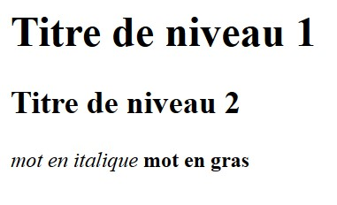

# Markdown to HTML
*Un logiciel qui convertie du Markdown en HTML (normalement)*

> ## *Markdown, qu'est-ce que c'est ?*
Le Markdown est un langage de programmation qui permet de faire la documentation d'un logiciel sans trop se soucier de la mise en page.

Comme par exemple ceci:
```markdown
# Titre de niveau 1
## Titre de niveau 2
*mot en italique*
**mot en gras**
```
Et en sortie ça donnera un Truc comme ça:

---
# Titre de niveau 1
## Titre de niveau 2
*mot en italique*

**mot en gras**

---

> ## *HTML, qu'est-ce que c'est ?*

Le Markdown est un langage de programmation qui permet de faire la structure d'une page web (le texte, les images, etc...)
On peut comparer ça à du Markdown beaucoup plus poussé.

Pour comparer nos deux langages voici le même texte que précédemment mais en HTML:

```html
<h1>Titre de niveau 1</h1>
<h2>Titre de niveau 2</h2>
<p>
    <i>mot en italique</i>
    <strong>mot en gras</strong>
</p>
```
---

Ce qui donnera, dans votre navigateur, un texte comme ça:



> ## *Pourquoi convertir du Markdown en HTML ?*

Le HTML est un langage plus complexe et plus puissant car il permet d'être lu par un navigateur, tandis que le Markdown, non.

> ## *Comment fonctionne ce logiciel ?*

Etant donné, que le logiciel est en développement, il n'est pas capable de convertir un fichier de Markdown en un fichier HTML.